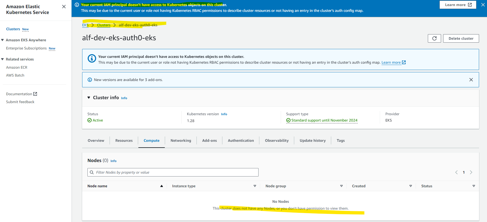

## Intro

How to configure Kubernetes on AWS to run some experiments,
deploy a service in Spring-Boot


### Deploy EKS with Terraform

When configuring the EKS with terraform I was following 
https://auth0.com/blog/terraform-eks-java-microservices/


My implementation is located here:
https://github.com/alfrepo/kubernetes-eks-spring-boot-prototype/tree/main


### Enabling IAM principal access to your cluster

"Current user or role does not have access to Kubernetes objects on this EKS Cluster"


When the EKS cluster is just provisioned, <br>
following https://auth0.com/blog/terraform-eks-java-microservices/ <br>
authorized by a ``federated role`` <br>
then your federated role will NOT have access to EKS on AWS Console<br> resulting in an error ``Your current IAM principal doesnt have access to Kubernetes objects on this cluster``. <br>

As I am loging in into the console via IAM 



You can follow the howto, to fix that

https://aws.amazon.com/de/blogs/containers/a-quick-path-to-amazon-eks-single-sign-on-using-aws-sso/


At the end this command empwers your role to use EKS on AWS console.
``` shell
eksctl create iamidentitymapping \
    --cluster $clustername \
    --arn "arn:aws:iam::$accountId:role/$rolename" \
    --username admin \
    --group system:masters
```

Where the role is retrieved via

```shell
# ssorole
# get only the role
aws sts get-caller-identity --query Arn --output text --profile default | cut -d/ -f2

AWSReservedSSO_AdministratorAccess-unrestricted_58c9bbf239970a34

```


## Terraform ##

You can execute this script via terraform e.g. like this


Save the Shell script: `enableRoleForEksIdempotent.sh` <br>
Here the environment variables ``rolename,accountId,clustername``  must be set from outside.

``` shell
#rolename="AWSReservedSSO_AdministratorAccess-unrestricted_58c9bbf239970a34"
#accountId="112233445566"
#clustername="alf-dev-eks-auth0-eks"

# non existant role gives:
#  Error: no iamidentitymapping with arn "arn:aws:iam::112233445566:role/AWSReservedSSO_AdministratorAccess-unrestricted_58c9bbf239970a34" found
eksctl_search_role=$(eksctl get iamidentitymapping  --cluster $clustername 2>&1)
echo $eksctl_search_role

# make the command idempotent, otherwise the role will be added every time again
if [[ $eksctl_search_role == *"$rolename"* ]]; then
    echo "Found the role. Dont recreate"
else
    echo "Not found the role. Add the role now."
    eksctl create iamidentitymapping \
        --cluster $clustername \
        --arn "arn:aws:iam::$accountId:role/$rolename" \
        --username admin \
        --group system:masters
fi

```


Use Terraform code with ``local-exec``
```shell

# Define a null_resource to trigger the script after the EKS cluster is created
resource "null_resource" "enable_federated_role_for_eksconsole_script" {
  # This resource depends on the creation of the EKS cluster
  depends_on = [module.eks.cluster_id]

  # triggered when the module.eks.cluster_id is modified
  triggers = {
    eks_cluster_id = module.eks.cluster_id
  }

  # Use the local-exec provisioner to execute your shell script
  provisioner "local-exec" {
    command = "bash enableRoleForEksIdempotent.sh"
    
    # You can also use environment variables or pass data to the script
    environment = {
      rolename = local.aws_federation_iam_rolename
      accountId = local.aws_account_id
      clustername = module.eks.cluster_name
    }
  }
}

```

And then it works


And when checking the ``aws-auth config-map`` where the IAM roles are mapped to EKS credentials

    kubectl edit configmap/aws-auth -n kube-system``

This is how it looks like

```yaml
    
    # Please edit the object below. Lines beginning with a '#' will be ignored,
    # and an empty file will abort the edit. If an error occurs while saving this file will be
    # reopened with the relevant failures.
    #
    apiVersion: v1
    data:
      mapRoles: |
        - groups:
          - system:bootstrappers
          - system:nodes
          rolearn: arn:aws:iam::112233445566:role/initial-eks-node-group-20231120121054428200000006
          username: system:node:{{EC2PrivateDNSName}}
        - groups:
          - system:masters
          rolearn: arn:aws:iam::112233445566:role/AWSReservedSSO_AdministratorAccess-unrestricted_58c9bbf239970a34
          username: admin
      mapUsers: |
        []
    kind: ConfigMap
    metadata:
      creationTimestamp: "2023-11-20T12:22:08Z"
      name: aws-auth
      namespace: kube-system
      resourceVersion: "30169"
      uid: e4e9eccd-0ea4-41de-83eb-8531f6601cd5

```

## Links

 - Howto for EKS on AWS with Terraform https://auth0.com/blog/terraform-eks-java-microservices/
 - Fix https://veducate.co.uk/aws-console-permission-eks-cluster/
 - Howto for using federated roles with EKS console https://docs.aws.amazon.com/eks/latest/userguide/add-user-role.html


