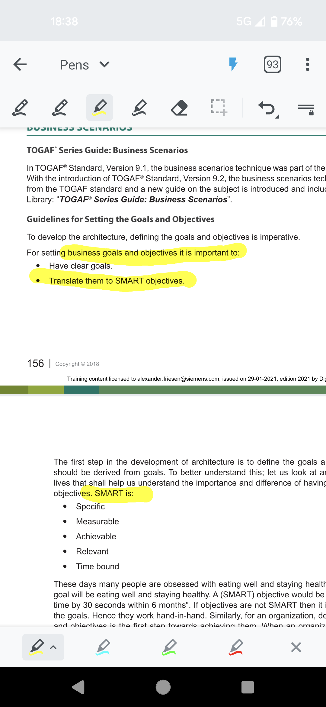
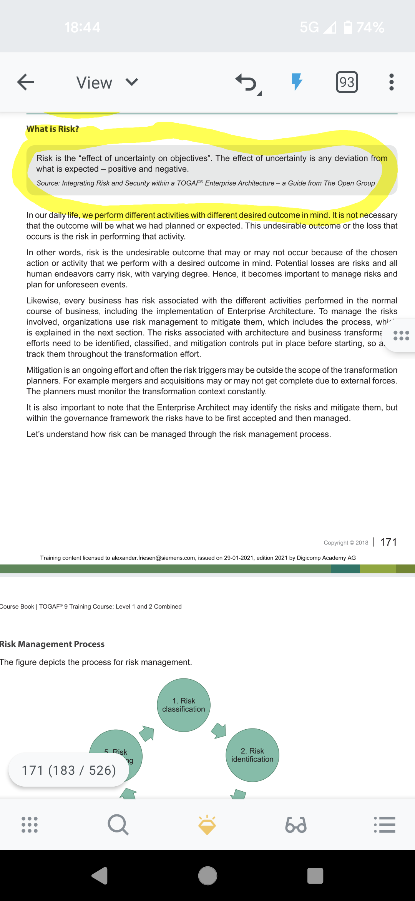

## Intro

How to present a case as a solution-architect?


## Interview Scenario: Designing a Secure Credit Card Management System

*Imagine you're leading a team tasked with architecting a secure credit card management system for a financial institution. The system will handle credit card issuance, transactions, and fraud detection while complying with industry standards and regulations.*

#### Context:

The institution intends to launch a digital platform to manage credit cards. The platform aims to provide customers with a seamless experience while ensuring the highest level of security and compliance.

#### Requirements Emphasis:

 - **1. Security**: Ensure the highest level of security to protect sensitive data.
 - **2. Reliability**: Design a system that minimizes downtime and has a robust disaster recovery plan.
 - **3. Compliance**: Adhere to industry regulations like PCI DSS, GDPR, and CCPA.
 - **4. Performance**: Maintain low latency and high throughput, especially during peak transaction periods.

#### Candidate's Task:

**Design the architecture of this credit card management system, considering the following aspects:**

**1. Authentication and Authorization**:

   * Outline a robust multi-factor authentication system for user login.
   * Define role-based access control for both users and administrators.

**2. Credit Card Management**:

   * Detail the process for issuing, activating, deactivating, and canceling credit cards.
   * Discuss how credit limits are set, adjusted, and monitored.
   * Explain how statements are generated and transaction history is tracked.

**3. Transaction Processing**:

   - Describe a real-time transaction processing system with support for various transaction types.
   - Discuss the integration with major card networks for authorization and clearing.

**4. Fraud Detection and Prevention**:

   - Present strategies for implementing advanced fraud detection algorithms.
   - Explain how real-time monitoring for suspicious activities and automated blockage of fraudulent transactions would work.

**5. Billing and Payments**:

   - Define the billing cycle management process with automated billing generation.
   - Detail the secure processing of payments, supporting multiple methods and currencies.

**6. Non-Functional Requirements Implementation**:

   - Propose strategies to meet security standards like PCI DSS and GDPR.
   - Discuss how the system will ensure high availability, scalability, and performance.

**7. Technical Stack and Infrastructure**:

   - Specify programming languages, frameworks, and secure protocols to be used.
   - Detail the infrastructure setup involving cloud services, redundancy, and load balancing.

**8. Testing and Optimization**:

   - Present plans for conducting scalability and performance testing.
   - Discuss strategies for optimizing database queries and system components.

The candidate will need to provide an architectural overview and explain the rationale behind their choices, emphasizing how the design aligns with the stated requirements and addresses potential challenges.


## Structure of the answer

Presenting a case as a solution architect involves a structured approach that effectively communicates your proposed solution. Here’s a step-by-step guide:

### 1. **Understand the Requirements:**

Gather detailed **requirements** from stakeholders.

  - the **problem**, 
  - the **constraints**, 
  - and **goals**.

There are different types of requirements, based on the type of the system:


#### Functional Requirements:

**1. User Authentication and Authorization:**

   - Secure login with **multi-factor** authentication.
   - **Role-based access control RBAC** for users and administrators.

**2. Credit Card Management:**

   - Ability to **issue, activate, deactivate, and cancel credit cards**.
   - **Credit limit** setting and adjustments.
   -** Statement generation** and **transaction history** tracking.

**3. Transaction Processing:**

   - **Real-time transaction processing** with high throughput.
   - Support for **different transaction types** (purchases, refunds, cash advances).
   - **Integration with card networks** (Visa, Mastercard, etc.) for **authorization** and **clearing**.

**4. Fraud Detection and Prevention:**

   - Implement advanced fraud detection algorithms.
   - Real-time monitoring for suspicious activities and transactions.
   - Automated blockage of potentially fraudulent transactions.

**5. Billing and Payments:**

   - Billing cycle management with automated billing generation.
   - Secure payment processing and reconciliation.
   - Support for different payment methods and currencies.

#### Non-Functional Requirements:


**1. Security:**

   - End-to-end encryption for sensitive data (card numbers, CVV codes).
   - Regular security audits and vulnerability assessments.

**2. Reliability and Availability:**

   - High availability with minimal downtime (99.99% uptime).
   - Disaster recovery plan and backup systems in place.

**3. Performance:**

   - Low latency for transaction processing (under a few seconds).
   - Scalability to handle peak transaction loads during high-traffic periods.

**4. Regulatory Compliance:**

   - Compliance with financial regulations and data protection laws (e.g., GDPR, CCPA).
   - Reporting capabilities to meet regulatory requirements.

**5. Audit Trails and Logging:**

   - Comprehensive logging of all system activities and transactions.
   - Ability to generate audit reports for compliance and analysis.

#### Technical Requirements:

**1. Technology Stack:**

   - Secure and robust programming languages and frameworks (e.g., Java, .NET, Python).
   - Use of secure protocols (TLS/SSL) for data transmission.
   - Database encryption and secure storage practices (encrypted at rest).

**2. Infrastructure and Hosting:**

   - Use of secure and reliable cloud infrastructure (AWS, Azure, etc.).
   - Redundant servers and load balancing for high availability.

**3. Scalability and Performance Testing:**

   - Conduct load testing to ensure the platform can handle peak transaction loads.
   - Performance tuning and optimization of database queries and system components.

The requirements for a financial credit card platform prioritize 

 - security, 
 - reliability, 
 - compliance, 
 - and performance 
 
 to ensure the integrity and safety of financial transactions and sensitive user data. 
 
 These requirements would likely be subject to rigorous scrutiny and adherence to industry standards and regulations.


### 2. **Define the Problem Statement:**

   - Clearly articulate the problem you're solving.
   - Highlight pain points and challenges.


#### Problem Statement:

##### Background:

The current financial landscape demands a robust and secure credit card platform that ensures seamless transactions, **safeguards sensitive user information**, and **complies with stringent regulatory requirements**. Existing systems lack the necessary scalability, real-time fraud detection, and comprehensive security measures, leading to vulnerabilities in transaction processing and data protection.

##### Key Challenges: 

**1. Security Vulnerabilities:** 

The absence of end-to-end encryption and robust security protocols poses a significant risk to sensitive cardholder data, exposing our platform to potential breaches and compliance violations.
  
**2. Scalability Limitations:** 

The inability to efficiently handle surges in transaction volumes during peak periods hampers our ability to deliver seamless user experiences and maintain high availability.

**3. Fraudulent Activities:** 

Current systems lack sophisticated fraud detection mechanisms, resulting in delayed identification and mitigation of fraudulent transactions, leading to financial losses and compromised trust among our user base.


**Impact:**

- *Security Risks:* Potential breaches could result in financial losses, reputational damage, and regulatory penalties, jeopardizing our standing within the industry.
  
- *User Experience:* Inadequate scalability and inefficient fraud detection impact user satisfaction, leading to potential attrition and loss of market share.

**Objective / Goal:**

Our objective is to design and develop a **cutting-edge credit card platform** that **prioritizes robust security** measures, **scalability** to handle **peak transaction loads**, and **real-time fraud detection capabilities**. 
By addressing these challenges, we aim to ensure the integrity of transactions, safeguard user data, and comply with regulatory standards while enhancing user experience and maintaining a competitive edge within the financial services sector.

---

This problem statement sets the stage by highlighting the critical challenges faced by the current system, emphasizing the impact of these challenges, and clearly stating the objectives for the proposed credit card platform. It provides a comprehensive overview that justifies the need for the specified system requirements in addressing the identified problems.


### 3. **Craft the Solution:**

   - Design a solution that aligns with requirements.
   - Consider scalability, security, performance, and feasibility.
   - Choose appropriate technologies, frameworks, and methodologies.


##### 3a. **Create the Architecture:**

   - Develop an **architecture diagram** showcasing **components**, **interactions**, and **data flows**.
   - Explain how different elements interact to achieve the solution.

### 4. **Present in a Structured Format:**

   - Start with an **introduction**, stating the problem.
   - Explain the **solution architecture**, detailing each component's role.
   - Address how the **solution meets the requirements**.
   - Discuss potential challenges and mitigation strategies.
   - Provide a roadmap for implementation and any dependencies.
   - Use visuals (diagrams, charts) to enhance understanding.


##### 4a. **Consider the Audience:**


   - Tailor your presentation to the technical understanding of your audience.
   - Address concerns specific to stakeholders (e.g., business, technical, financial).
   - Emphasize the advantages of your proposed solution for the target audience.
   


##### 4b. **Engage and Communicate Effectively:**

   - Engage your audience by making the presentation interactive.
   - Use clear language and avoid jargon overload.
   - Be confident, articulate, and receptive to feedback.


##### 4c. **Prepare for Q&A:**

   - Anticipate questions and prepare thorough answers.
   - Be ready to defend your choices with reasoning and evidence.
   - After the presentation, be available for further discussions or clarifications.
   - Incorporate feedback for continuous improvement.


Presenting as a solution architect involves not just delivering a plan but also conveying the rationale behind your decisions. 

Your ability to communicate technical details effectively while addressing stakeholder concerns will greatly influence the success of your presentation.


## TODO

 - add risk
 - add migration
 - add timeline
   - Quality gateways
   - ITsecurity Management

- mention testing
- mention automation, DevOps
- add solution : block level
- add some options for deployment, mention when to pick an option according to TOGAF (Opportunities&Solutions, Migration planing)


## Helpful definitions

#### Principles, Goals - to SMART Objectives

```
Principles: These are the fundamental guidelines or rules that form the foundation for decision-making in an organization's architecture development. 

- data security is important (privacy by design in GDPR)
- system must be reliable
- system must be responsive
```

Derive clear goals from "Requirements" section.




#### Risk

```
Risk: is the ‘effect of uncertainty on objectives’. The effect of uncertainty is any deviation from what is expected - positive and negative.
```




## Links
 - TOGAF ADM intro by visual paradigm <https://circle.visual-paradigm.com/docs/togaf-adm-guide-through/togaf-adm-introduction/>
 - Hermes Projekt <http://ec2-34-242-70-192.eu-west-1.compute.amazonaws.com/onlinepublikation/index.xhtml?element=kategorie_rollen.html>
 


