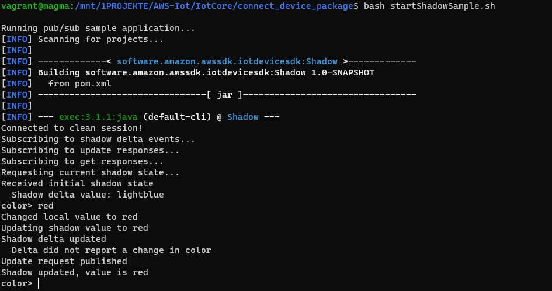
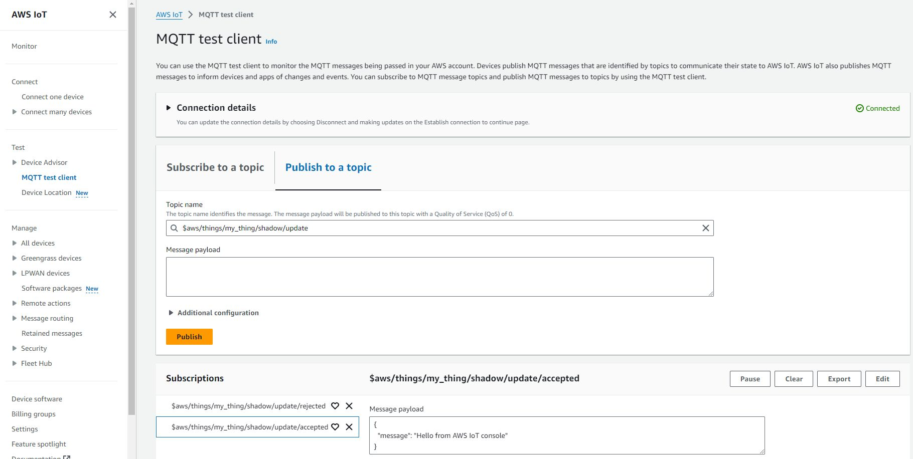

## Intro

AWS Iot


## Pub Sub

Pub-Sub is one possible way to communicate with the cloud-state of a "thing".

Its for unidirectional `Device -> Cloud` communicaiton, where the device is communicating a message into the cloud.


For that you must set up

- a thing
- a thing-certificate, to authenticate your hardware
- an iot policy 

The easiest way to start the wizard under `AWS IoT > Connect > Connect one device`.

It will generate all of that for ya.

It will download the sample application from <https://github.com/aws/aws-iot-device-sdk-java-v2.git>

To start the example - call `startPubSub.sh`.


My configured one looks as following

``` shell
#!/usr/bin/env bash
# stop script on error
set -e

# Check to see if root CA file exists, download if not
if [ ! -f ./root-CA.crt ]; then
  printf "\nDownloading AWS IoT Root CA certificate from AWS...\n"
  curl https://www.amazontrust.com/repository/AmazonRootCA1.pem > root-CA.crt
fi

# install AWS Device SDK for Java if not already installed
if [ ! -d ./aws-iot-device-sdk-java-v2 ]; then
  printf "\nInstalling AWS SDK...\n"
  git clone https://github.com/aws/aws-iot-device-sdk-java-v2.git --recursive
  cd aws-iot-device-sdk-java-v2
  mvn versions:use-latest-versions -Dincludes="software.amazon.awssdk.crt*"
  mvn clean install -Dmaven.test.skip=true
  cd ..
fi

# run pub/sub sample app using certificates downloaded in package
printf "\nRunning pub/sub sample application...\n"
cd aws-iot-device-sdk-java-v2
mvn exec:java -pl samples/BasicPubSub -Dexec.mainClass=pubsub.PubSub -Dexec.args='--endpoint a2d9kozl1enivw-ats.iot.eu-west-1.amazonaws.com --message "{ \"message\" : \"Hello_alf2\" }" --client_id sdk-java --topic sdk/test/java --ca_file ../root-CA.crt --cert ../my_thing.cert.pem --key ../my_thing.private.key'
```


The thing-endpoint is unique per account and is in:


## Device Shadow

Pub-Sub is one possible way to communicate with the cloud-state of a "thing".

Its for bidirectional `Device <-> Cloud` communicaiton, where the device is syncing the desired/reported state with cloud.


The "Device Shadow URL" in AWS IoT refers to the URL that is used to access and manage the device shadow for an IoT thing.

     GET https://myendpoint.iot.us-east-1.amazonaws.com/things/myThing/shadow

This would return the latest device shadow document. Updates can be made by sending a PUT request to the same URL with a new state document.


The policy under `Security> TODO` must allow the communication to the shadow.

Thats a wildcard policy, which works for the test

```json
{
  "Version": "2012-10-17",
  "Statement": [
    {
      "Effect": "Allow",
      "Action": [
        "iot:Publish"
      ],
      "Resource": [
        "arn:aws:iot:eu-west-1:913372342854:topic/$aws/things/*/shadow/get",
        "arn:aws:iot:eu-west-1:913372342854:topic/$aws/things/*/shadow/update"
      ]
    },
    {
      "Effect": "Allow",
      "Action": [
        "iot:Receive"
      ],
      "Resource": [
        "arn:aws:iot:eu-west-1:913372342854:topic/$aws/things/*/shadow/get/accepted",
        "arn:aws:iot:eu-west-1:913372342854:topic/$aws/things/*/shadow/get/rejected",
        "arn:aws:iot:eu-west-1:913372342854:topic/$aws/things/*/shadow/update/accepted",
        "arn:aws:iot:eu-west-1:913372342854:topic/$aws/things/*/shadow/update/rejected",
        "arn:aws:iot:eu-west-1:913372342854:topic/$aws/things/*/shadow/update/delta"
      ]
    },
    {
      "Effect": "Allow",
      "Action": [
        "iot:Subscribe"
      ],
      "Resource": [
        "arn:aws:iot:eu-west-1:913372342854:topicfilter/$aws/things/*/shadow/get/accepted",
        "arn:aws:iot:eu-west-1:913372342854:topicfilter/$aws/things/*/shadow/get/rejected",
        "arn:aws:iot:eu-west-1:913372342854:topicfilter/$aws/things/*/shadow/update/accepted",
        "arn:aws:iot:eu-west-1:913372342854:topicfilter/$aws/things/*/shadow/update/rejected",
        "arn:aws:iot:eu-west-1:913372342854:topicfilter/$aws/things/*/shadow/update/delta"
      ]
    },
    {
      "Effect": "Allow",
      "Action": "iot:Connect",
      "Resource": "arn:aws:iot:eu-west-1:913372342854:client/*"
    }
  ]
}
```


This script must be like


`startShadowSample.sh`

```shell
#!/usr/bin/env bash
# stop script on error
set -e

# Check to see if root CA file exists, download if not
if [ ! -f ./root-CA.crt ]; then
  printf "\nDownloading AWS IoT Root CA certificate from AWS...\n"
  curl https://www.amazontrust.com/repository/AmazonRootCA1.pem > root-CA.crt
fi

# install AWS Device SDK for Java if not already installed
if [ ! -d ./aws-iot-device-sdk-java-v2 ]; then
  printf "\nInstalling AWS SDK...\n"
  git clone https://github.com/aws/aws-iot-device-sdk-java-v2.git --recursive
  cd aws-iot-device-sdk-java-v2
  mvn versions:use-latest-versions -Dincludes="software.amazon.awssdk.crt*"
  mvn clean install -Dmaven.test.skip=true
  cd ..
fi

# run pub/sub sample app using certificates downloaded in package
printf "\nRunning pub/sub sample application...\n"
cd aws-iot-device-sdk-java-v2
mvn exec:java -pl samples/Shadow -Dexec.mainClass=shadow.ShadowSample -Dexec.args='--endpoint a2d9kozl1enivw-ats.iot.eu-west-1.amazonaws.com \
  --shadow_name my_thing_shadow \
  --ca_file ../root-CA.crt \
  --cert ../my_thing.cert.pem \
  --client_id test-alf \
  --thing_name "my_thing" \
  --key ../my_thing.private.key'

```

Here I run the script which would run on the device.

I changed the color to `red` here.




And this arrived in cloud




## Links

 - <https://docs.aws.amazon.com/iot/latest/developerguide/iot-device-shadows.html>
 - <https://docs.aws.amazon.com/iot/latest/developerguide/device-shadow-rest-api.html>

