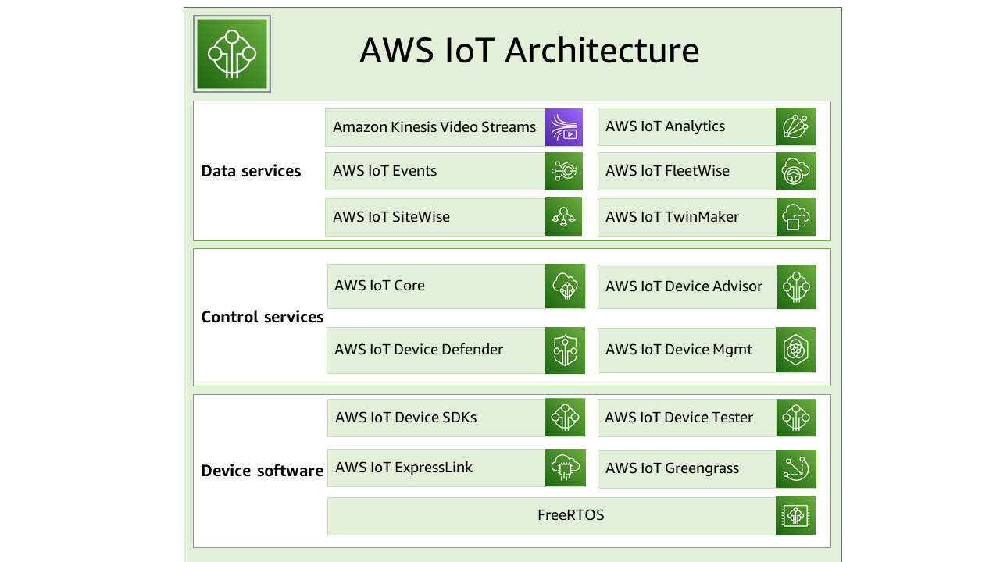
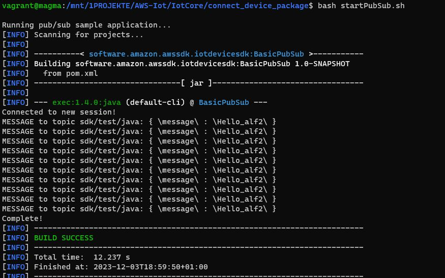
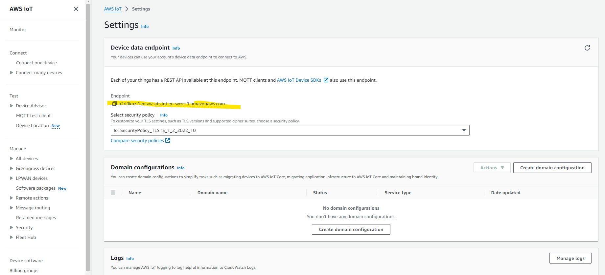
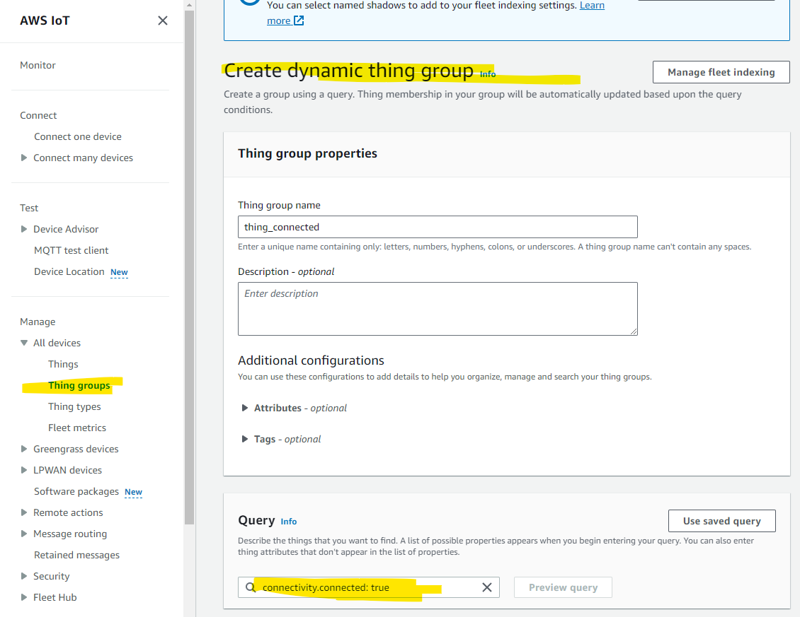
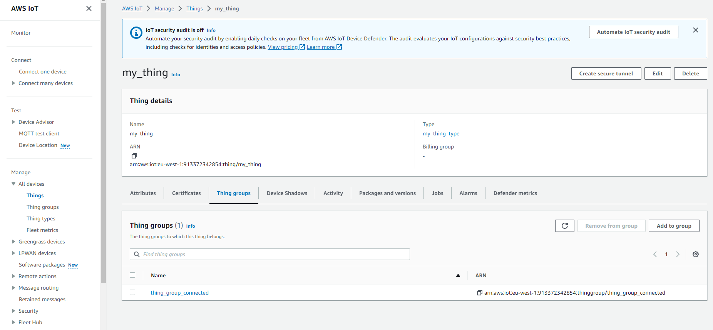
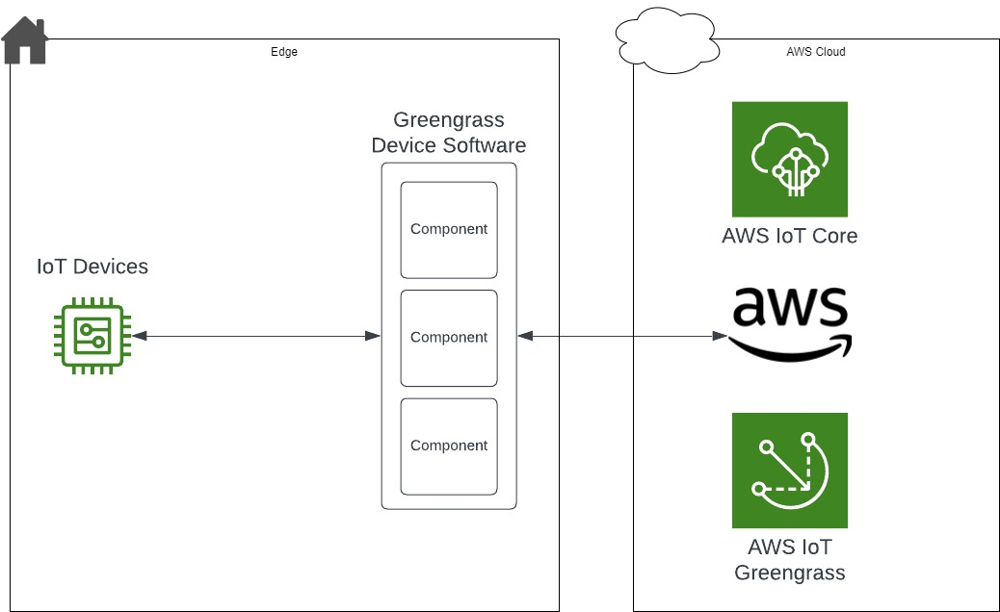

## Intro

AWS Iot




<https://docs.aws.amazon.com/iot/latest/developerguide/aws-iot-how-it-works.html>

## Pub Sub

Pub-Sub is one possible way to communicate with the cloud-state of a "thing".

Its for unidirectional `Device -> Cloud` communicaiton, where the device is communicating a message into the cloud.


For that you must set up

- a thing
- a thing-certificate, to authenticate your hardware
- an iot policy 

The easiest way to start the wizard under `AWS IoT > Connect > Connect one device`.

It will generate all of that for ya.

It will download the sample application from <https://github.com/aws/aws-iot-device-sdk-java-v2.git>

To start the example - call `startPubSub.sh`.


My configured one looks as following.

``` shell
#!/usr/bin/env bash
# stop script on error
set -e

# Check to see if root CA file exists, download if not
if [ ! -f ./root-CA.crt ]; then
  printf "\nDownloading AWS IoT Root CA certificate from AWS...\n"
  curl https://www.amazontrust.com/repository/AmazonRootCA1.pem > root-CA.crt
fi

# install AWS Device SDK for Java if not already installed
if [ ! -d ./aws-iot-device-sdk-java-v2 ]; then
  printf "\nInstalling AWS SDK...\n"
  git clone https://github.com/aws/aws-iot-device-sdk-java-v2.git --recursive
  cd aws-iot-device-sdk-java-v2
  mvn versions:use-latest-versions -Dincludes="software.amazon.awssdk.crt*"
  mvn clean install -Dmaven.test.skip=true
  cd ..
fi

# run pub/sub sample app using certificates downloaded in package
printf "\nRunning pub/sub sample application...\n"
cd aws-iot-device-sdk-java-v2
mvn exec:java -pl samples/BasicPubSub -Dexec.mainClass=pubsub.PubSub -Dexec.args='--endpoint a2d9kozl1enivw-ats.iot.eu-west-1.amazonaws.com --message "{ \"message\" : \"Hello_alf2\" }" --client_id my_thing --topic sdk/test/java --ca_file ../root-CA.crt --cert ../my_thing.cert.pem --key ../my_thing.private.key'
```




The thing-endpoint is unique per account and is in:




### Tracking the state of thing via indexing

AWS Iot is capable to track the status of things, like "connected/disconnected."

Above, by providing the `-clientId my_thing` I am connecting as a "device/thing" **named "my_thing"**.

Accoding to the [AWS docu](https://docs.aws.amazon.com/iot/latest/developerguide/fleet-indexing-troubleshooting.html#aggregation-troubleshooting) the clientId must match the thing-name, so that the **connectivity-status-data** can be assigned to a **thing**.

```
The connectivity status data is indexed only for connections where the client ID has a matching thing name.
```


So to auto-track the connectivity:


#### 1. Connect with clientId=THING_NAME

So that AWS can recognize which thing is connecting.

#### 2. Enable thing indexing

Enable `settings > Fleet indexing`.

So that AWS starts tracking the connect-state. And some other parameters, which you even can pick, to reflect your domain.


#### 3. create a group, which would dynamically group connected devices

This group "thing_group_connected" will contain only connected devices.

Devices  will be added dynamically to the group, based on whether the device is online  (e.g. connected via PubSub or Shadow SDK) and receiving data.




#### 4. see your thing going into connected state

You connect on behalf of your thing.


As soon as you are connectedon behalf of "my_thing" *(`clientId` is set to  `my_thing`) appears in  "thing_group_connected" group.




## Device Shadow

Pub-Sub is one possible way to communicate with the cloud-state of a "thing".

Its for bidirectional `Device <-> Cloud` communicaiton, where the device is syncing the desired/reported state with cloud.


The "Device Shadow URL" in AWS IoT refers to the URL that is used to access and manage the device shadow for an IoT thing.

     GET https://myendpoint.iot.us-east-1.amazonaws.com/things/myThing/shadow

This would return the latest device shadow document. Updates can be made by sending a PUT request to the same URL with a new state document.


The policy under `Security> TODO` must allow the communication to the shadow.

Thats a wildcard policy, which works for the test

```json
{
  "Version": "2012-10-17",
  "Statement": [
    {
      "Effect": "Allow",
      "Action": [
        "iot:Publish"
      ],
      "Resource": [
        "arn:aws:iot:eu-west-1:913372342854:topic/$aws/things/*/shadow/get",
        "arn:aws:iot:eu-west-1:913372342854:topic/$aws/things/*/shadow/update"
      ]
    },
    {
      "Effect": "Allow",
      "Action": [
        "iot:Receive"
      ],
      "Resource": [
        "arn:aws:iot:eu-west-1:913372342854:topic/$aws/things/*/shadow/get/accepted",
        "arn:aws:iot:eu-west-1:913372342854:topic/$aws/things/*/shadow/get/rejected",
        "arn:aws:iot:eu-west-1:913372342854:topic/$aws/things/*/shadow/update/accepted",
        "arn:aws:iot:eu-west-1:913372342854:topic/$aws/things/*/shadow/update/rejected",
        "arn:aws:iot:eu-west-1:913372342854:topic/$aws/things/*/shadow/update/delta"
      ]
    },
    {
      "Effect": "Allow",
      "Action": [
        "iot:Subscribe"
      ],
      "Resource": [
        "arn:aws:iot:eu-west-1:913372342854:topicfilter/$aws/things/*/shadow/get/accepted",
        "arn:aws:iot:eu-west-1:913372342854:topicfilter/$aws/things/*/shadow/get/rejected",
        "arn:aws:iot:eu-west-1:913372342854:topicfilter/$aws/things/*/shadow/update/accepted",
        "arn:aws:iot:eu-west-1:913372342854:topicfilter/$aws/things/*/shadow/update/rejected",
        "arn:aws:iot:eu-west-1:913372342854:topicfilter/$aws/things/*/shadow/update/delta"
      ]
    },
    {
      "Effect": "Allow",
      "Action": "iot:Connect",
      "Resource": "arn:aws:iot:eu-west-1:913372342854:client/*"
    }
  ]
}
```


This script must be like


`startShadowSample.sh`

```shell
#!/usr/bin/env bash
# stop script on error
set -e

# Check to see if root CA file exists, download if not
if [ ! -f ./root-CA.crt ]; then
  printf "\nDownloading AWS IoT Root CA certificate from AWS...\n"
  curl https://www.amazontrust.com/repository/AmazonRootCA1.pem > root-CA.crt
fi

# install AWS Device SDK for Java if not already installed
if [ ! -d ./aws-iot-device-sdk-java-v2 ]; then
  printf "\nInstalling AWS SDK...\n"
  git clone https://github.com/aws/aws-iot-device-sdk-java-v2.git --recursive
  cd aws-iot-device-sdk-java-v2
  mvn versions:use-latest-versions -Dincludes="software.amazon.awssdk.crt*"
  mvn clean install -Dmaven.test.skip=true
  cd ..
fi

# run pub/sub sample app using certificates downloaded in package
printf "\nRunning pub/sub sample application...\n"
cd aws-iot-device-sdk-java-v2
mvn exec:java -pl samples/Shadow -Dexec.mainClass=shadow.ShadowSample -Dexec.args='--endpoint a2d9kozl1enivw-ats.iot.eu-west-1.amazonaws.com \
  --shadow_name my_thing_shadow \
  --ca_file ../root-CA.crt \
  --cert ../my_thing.cert.pem \
  --client_id my_thing \
  --thing_name "my_thing" \
  --key ../my_thing.private.key'

```

Here I run the script which would run on the device.

I changed the color to `red` here.


And this arrived in cloud


### Greengrass

The "Gateway" solution of AWS, which allows deploying components on edge.




#### Core device - the Gateway "Nucleus"

In AWS Greengrass, the Nucleus is a **core component** of the Greengrass Core software. It serves as the foundational piece that enables local execution of AWS Lambda functions, device shadows, and manages communications between the devices and the AWS cloud.


The Nucleus handles several critical functions:

1. **Local Execution:** It allows for the deployment and execution of AWS Lambda functions on edge devices. This enables computation and processing to occur closer to the data source, reducing latency and reliance on cloud services.

2. **Device Shadows:** Nucleus manages the synchronization of device shadows. Device shadows are representations of devices and their state in the cloud, allowing interactions and synchronization even when devices are offline or have intermittent connectivity.

3. **Communication and Coordination:** It facilitates communication between the edge devices and AWS services. This involves managing connections, handling messaging, and ensuring secure communication between the edge and the cloud.

4. **Security:** The Nucleus plays a vital role in enforcing security protocols and policies, ensuring that communications and interactions between the devices and the cloud are secure.

Essentially, the **Nucleus in AWS Greengrass is the core engine that empowers edge computing by extending AWS services** to the edge, enabling local processing, and facilitating communication between edge devices and the AWS Cloud.


#### Components

In AWS Greengrass, alongside the core functionality provided by the Nucleus, there are several **non-core components** that extend the capabilities and functionalities of the Greengrass Core software. These non-core components include:

1. **Connectors:** These enable integration with third-party services and protocols, allowing Greengrass to interact with a wide range of devices and systems beyond the AWS ecosystem.

2. **ML Inference:** Machine Learning (ML) inference components enable running machine learning models at the edge, allowing for real-time inference without relying heavily on cloud-based services.

3. **Stream Manager:** This component assists in managing data streams, offering functionalities such as buffering, aggregation, and managing data flows to and from the edge devices.

4. **Local Resource Access:** Provides secure access to local resources such as files, hardware interfaces, or other peripherals connected to the edge device, allowing for efficient utilization of local resources in Greengrass applications.

5. **OTA (Over-The-Air) Updates:** These components handle firmware and software updates for devices connected to Greengrass, allowing remote management and updating of software on edge devices.

6. **Security Add-ons:** Additional security components and protocols can be integrated to enhance security measures beyond the core security features provided by the Nucleus.

These non-core components augment the capabilities of Greengrass, allowing for greater customization, integration with diverse systems, and extending functionalities to cater to specific edge computing requirements.


There are (different types)[https://docs.aws.amazon.com/greengrass/v2/developerguide/develop-greengrass-components.html#component-types] of coponents

Depending on the type (plugin, generic, ..) Nucleus enforces different lifecycles on the components.


## Links

 - <https://docs.aws.amazon.com/iot/latest/developerguide/iot-device-shadows.html>
 - <https://docs.aws.amazon.com/iot/latest/developerguide/device-shadow-rest-api.html>

