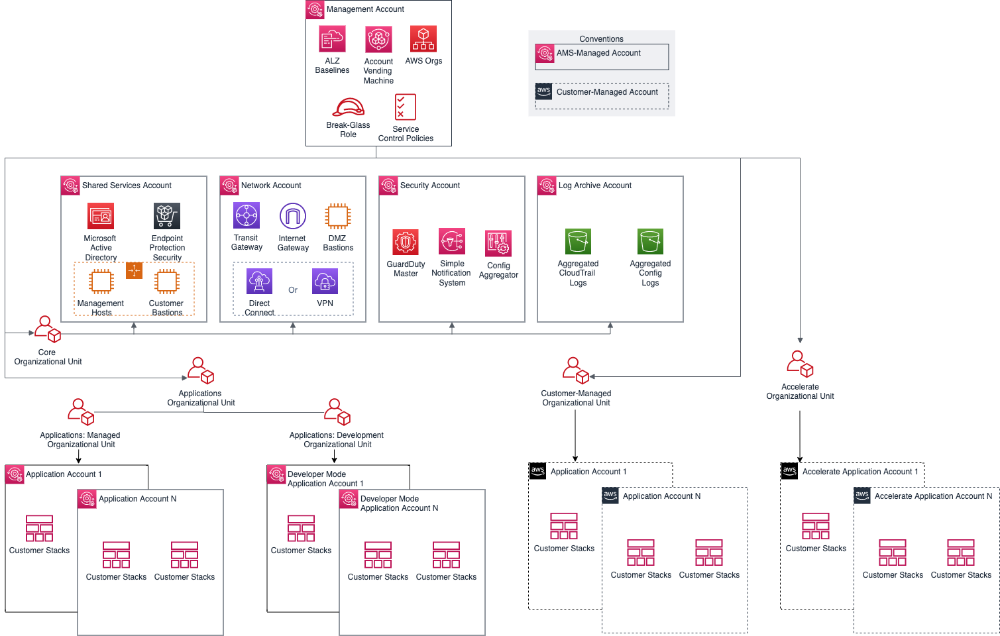
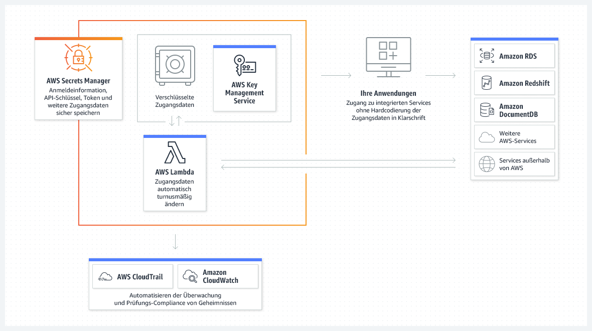
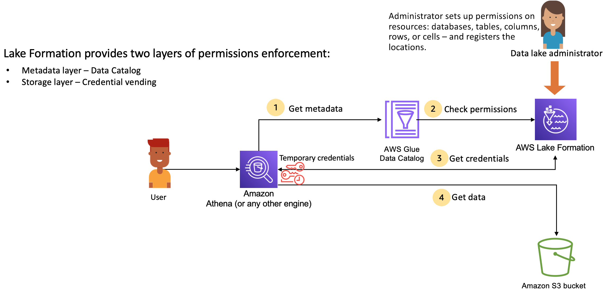

## Intro

List of AWS services, which are helpful to centralize governance in AWS

## Description

Here are some of the AWS services that are helpful to centralize governance in AWS: 

* **AWS Organizations**
 

 <https://docs.aws.amazon.com/managedservices/latest/onboardingguide/malz-net-arch-section.html>

 

 <https://aws.amazon.com/de/blogs/security/use-aws-firewall-manager-to-deploy-protection-at-scale-in-aws-organizations/>

AWS Organizations is a service that lets you centralize management and governance of your AWS accounts and resources across multiple regions. With Organizations, you can create multiple AWS accounts to isolate different environments, such as production, development, and testing. You can also use Organizations to define policies that control access to resources and enforce compliance with your security and compliance standards.

* **AWS Control Tower**
 

AWS Control Tower is a service that provides a fully managed way to set up and manage a secure, multi-account AWS environment. Control Tower simplifies the process of provisioning and configuring new accounts, and it provides a central console for managing your AWS environment. With Control Tower, you can enforce security and compliance policies across your AWS accounts, and you can also automate common tasks, such as creating and configuring networks, VPCs, and security groups.

* **AWS Config**

AWS Config is a service that tracks and records changes to your AWS resources. This information can be used to detect and troubleshoot configuration drift, and it can also be used to audit your AWS environment for compliance with your security and compliance standards.

* **AWS CloudTrail**

AWS CloudTrail is a service that records AWS API calls made from your AWS account. This information can be used to track user activity, to troubleshoot issues, and to audit your AWS environment for compliance with your security and compliance standards.

* **AWS Inspector**

AWS Inspector is a service that can scan your AWS infrastructure for security vulnerabilities. Inspector can scan your EC2 instances, your S3 buckets, and your VPCs, and it can also scan your network traffic for suspicious activity.

* **AWS Security Hub**

AWS Security Hub provides a centralized view of your AWS security posture. Security Hub can aggregate security alerts and findings from AWS Config, AWS CloudTrail, and other AWS services, and it can also integrate with third-party security solutions.

* **AWS Secrets Manager**

AWS Secrets Manager is a service that securely stores and manages sensitive data, such as passwords, access keys, and API keys. Secrets Manager can store this data in a central repository, and it can also rotate the data on a regular basis to help protect against data breaches.

* **AWS Lake Formation**

AWS Lake Formation is a service that helps you to build, manage, and secure data lakes in AWS. Lake Formation provides a centralized platform for managing your data lake, and it can also help you to enforce data governance policies.

* **AWS X-Ray**

AWS X-Ray is a service that helps you to debug and troubleshoot distributed applications. X-Ray can trace requests as they flow through your application and across multiple AWS services, and it can also help you to identify performance bottlenecks and identify potential security vulnerabilities.

These are just a few of the many AWS services that can help you to centralize governance in AWS. With the right combination of services, you can create a secure, compliant, and efficient AWS environment.

* **AWS Firewall Manager (FMS)**

<https://aws.amazon.com/de/blogs/security/use-aws-firewall-manager-to-deploy-protection-at-scale-in-aws-organizations/>

Centralized rule management: You can define firewall rules in a centralized location, and FMS will automatically deploy them to your VPCs. This can help you to avoid the need to manage firewall rules in multiple accounts and VPCs or accounts.

## Links

 

