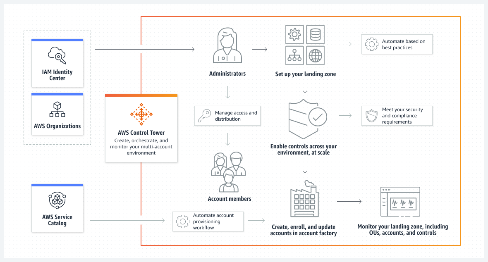
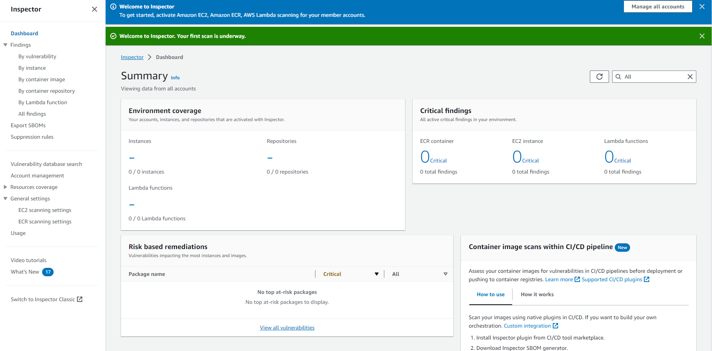
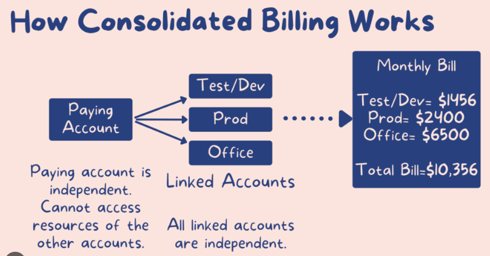

## Intro

List of AWS services, which are helpful to centralize governance in AWS

## Description

Here are some of the AWS services that are helpful to centralize governance in AWS: 

### AWS Organizations

 

 <https://docs.aws.amazon.com/managedservices/latest/onboardingguide/malz-net-arch-section.html>

 

 <https://aws.amazon.com/de/blogs/security/use-aws-firewall-manager-to-deploy-protection-at-scale-in-aws-organizations/>

AWS Organizations is a service that lets you centralize management and governance of your AWS accounts and resources across multiple regions. With Organizations, you can create multiple AWS accounts to isolate different environments, such as production, development, and testing. You can also use Organizations to define policies that control access to resources and enforce compliance with your security and compliance standards.

### AWS Control Tower

 

AWS Control Tower is a service that provides a fully managed way to set up and manage a secure, multi-account AWS environment. Control Tower simplifies the process of provisioning and configuring new accounts, and it provides a central console for managing your AWS environment. With Control Tower, you can enforce security and compliance policies across your AWS accounts, and you can also automate common tasks, such as creating and configuring networks, VPCs, and security groups.

### AWS Config

Reinvent demo 
<https://youtu.be/kErRv4YB_T4?si=Kzc6VwbmZkApz5mR&t=2036>

AWS Config is a service that **tracks and records changes to your AWS resources**. 

This information can be used to **detect and troubleshoot configuration drift**, and it can also be used to **audit your AWS environment for compliance** with your security and compliance standards.

#### Conformance pack

A **conformance pack** is a collection of AWS Config rules and remediation actions that can be deployed as a single entity in a single account or multiple accounts in an AWS Organizations.

#### Global service - single region

AWS IAM is a **global service**. For global services, AWS Config should be enabled **only in a single region** to avoid getting duplicate copies of configuration items and in turn, minimize cost. 

#### Aggregator

Demo <https://youtu.be/kErRv4YB_T4?si=fdcoFiOHjKJcVLwD&t=2067>

An **Aggregator** is an AWS Config resource that collects configuration data from multiple accounts across multiple regions. There are two types of Aggregators,

1.  **Individual accounts** aggregator: Authorization will be required for each of the source accounts from which configuration data is to be collected.
2.  **Organization aggregator**: Authorization is not required for member accounts in AWS Organization as authorization is integrated with the Organization service.

For more information on AWS Config, refer to the following URLs,

*   [https://aws.amazon.com/blogs/mt/aws-config-best-practices/](https://aws.amazon.com/blogs/mt/aws-config-best-practices/)
*   [https://docs.aws.amazon.com/config/latest/developerguide/conformance-packs.html](https://docs.aws.amazon.com/config/latest/developerguide/conformance-packs.html)
*   [https://docs.aws.amazon.com/config/latest/developerguide/aggregate-data.html](https://docs.aws.amazon.com/config/latest/developerguide/aggregate-data.html)

### AWS Proton

AWS Proton is designed to increase the impact of platform engineering by implementing scalable **self-service capabilities for developers**². It empowers developers to move faster with a **self-service tool** to provision **infrastructure** and **manage code deployment**.

It provides **automated infrastructure as code provisioning** and deployment for serverless and container-based applications¹. 

Its for 

 - infrastructure admins
 - developers

As an **administrator**, you can create versioned service templates that define standardized infrastructure and deployment tooling for **serverless** and **container-based applications**¹. AWS Proton identifies all existing service instances that are using an outdated template version and allows you to upgrade them with one click¹.

As an **application developer**, you can select from the **available service templates** to automate your application or service deployments¹. AWS Proton automatically 

- provisions the resources, 
- configures the CI/CD pipeline, and 
- deploys the code into the defined infrastructure¹.

(1) What is AWS Proton? - AWS Proton. https://docs.aws.amazon.com/proton/latest/userguide/Welcome.html.
(2) Application Delivery Service - AWS Proton - AWS. https://aws.amazon.com/proton/.
(3) AWS Announces General Availability of AWS Proton - Press Center. https://press.aboutamazon.com/2021/6/aws-announces-general-availability-of-aws-proton.
(4) What you need to know about the new AWS Proton service - Pluralsight. https://www.pluralsight.com/resources/blog/cloud/what-you-need-to-know-about-the-new-aws-proton-service.
(5) AWS Introduces Proton - a New Container Management Service in ... - InfoQ. https://www.infoq.com/news/2020/12/aws-proton-container-serverless/.
(6) AWS Proton: A first look | Containers. https://aws.amazon.com/blogs/containers/intro-to-aws-proton/.
(7) Tutorial: using the AWS Proton plugins for Backstage - GitHub. https://github.com/awslabs/aws-proton-plugins-for-backstage/blob/main/docs/tutorial.md.

### AWS CloudTrail

AWS CloudTrail is a service that records AWS API calls made from your AWS account. This information can be used to track user activity, to troubleshoot issues, and to audit your AWS environment for compliance with your security and compliance standards.

### AWS Inspector

AWS Inspector is a service that can scan your AWS infrastructure for security vulnerabilities. Inspector can scan your EC2 instances, your S3 buckets, and your VPCs, and it can also scan your network traffic for suspicious activity.

### AWS Security Hub

AWS Security Hub provides a centralized view of your AWS security posture. Security Hub can aggregate security alerts and findings from AWS Config, AWS CloudTrail, and other AWS services, and it can also integrate with third-party security solutions.

### AWS Secrets Manager

AWS Secrets Manager is a service that securely stores and manages sensitive data, such as passwords, access keys, and API keys. Secrets Manager can store this data in a central repository, and it can also rotate the data on a regular basis to help protect against data breaches.

### AWS Lake Formation

AWS Lake Formation is a service that helps you to build, manage, and secure data lakes in AWS. Lake Formation provides a centralized platform for managing your data lake, and it can also help you to enforce data governance policies.

### AWS Firewall Manager (FMS)

See Reinvent 
<https://youtu.be/lTJxWAiQrHM?si=EoVasfr8MVK8_Yaf&t=1>

<https://aws.amazon.com/de/blogs/security/use-aws-firewall-manager-to-deploy-protection-at-scale-in-aws-organizations/>

Firewall Manager uses **AWS Config** in the background.

AWS Firewall Manager is a security management service that helps 
across **multiple accounts**

- centrally configure and manage **firewall rules**  and applications in AWS Organizations.  
- helps to provision **AWS WAF rules**, 
- create **AWS Shield advanced** protection, and 
- enable **security groups for Amazon EC2 instances** launched **across multiple accounts** in AWS Organizations. 

Following are the three prerequisites for using AWS Firewall Manager

1.  AWS Organizations should be used to manage accounts with all features enabled.
2.  One of the accounts in the AWS Organizations should be designated as an administrator for AWS Firewall Manager.
3.   AWS Config must be enabled on all the accounts within the AWS Organizations.

Once these prerequisites are met, AWS Firewall can be used to create a master security group. Policies are created in AWS Firewall which is applied to individual application security groups by mapping to specific application name/value tags.

### AWS Consolidated Billing

To use AWS Consolidated Billing, you must create a management account in AWS Organizations and add your member accounts to the organization. You can then enable consolidated billing for the organization. Once consolidated billing is enabled, AWS will automatically consolidate the usage and costs of all member accounts into a single invoice.

To enable consolidated billing, follow these steps:

1. Go to the **AWS Organizations** console and select the management account for which you want to enable consolidated billing.
2. In the **Accounts** section, select the **Member accounts** link.
3. Select the check box for the account that you want to add to consolidated billing.
4. Click the **Add to consolidated billing** button.
5. On the **Enable consolidated billing** page, select the **Enable consolidated billing** button.

## Links

 

