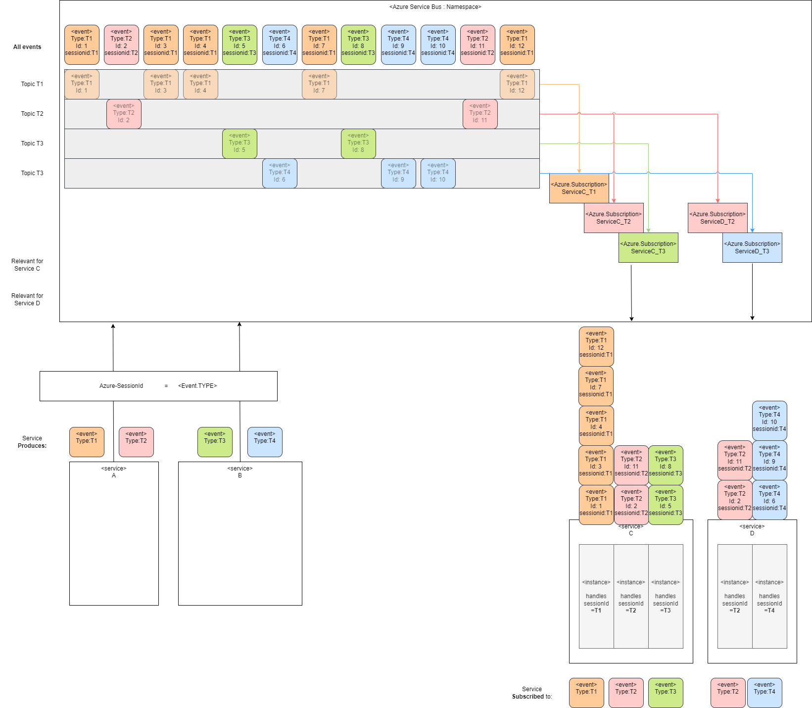

## Intro

How to implement inter-Service communication
making sure, that 
 - **"FIFO" guarantee** with  Azure Service Bus is implemented
 - **"FIFO" guarantee** with the Azure Service Bus is used

### Goal

 - There are **2 Producer** Services **A and B**
   - **Service A** produces events of type: **T1, T2**
   - **Service B** produces events of type: **T3, T4**

 - There are **2 Consumer** Services: **C and D**
   - Consumer services **scale horizontally**, so each of them has **multiple instances**
   - Each instance will consume those types of events from the message bus, in which its interested in
   - Each **instance can fail** after a while and put back the event, for reprocessing. That must NOT affect the event processing order.

### Constraints

 - The  **FIFO ORDER** MUST be enforced within a **single message-type**

        That's to simulate the situation, where each service is sending its own events and is not aware of what others are doing, which is realistic.

### Description

The approach:

can be solved by using 

- one topic per message-type, to enable services to subscribe for **message-types of interest only** 
- use an own **subscription** per service, to introduce a dedicated **sub-queue** per service.    See "A topic subscription resembles a virtual queue that receives copies of the messages that are sent to the topic." <https://learn.microsoft.com/en-us/azure/service-bus-messaging/service-bus-queues-topics-subscriptions>
- use "**sessions-ids**" to demultiplex messages and map those to instances in each service.    See "Sessions provide concurrent demultiplexing of interleaved message streams while preserving and guaranteeing ordered delivery" https://learn.microsoft.com/en-us/azure/service-bus-messaging/message-sessions#session-features    In the example those are **per message-type**, but they can be per meaningful session-identifier like "orderId"

### Conclusion

Downsides:

- Separate service-instances by event-types is probably not realistic. As a single service-instance will have to work with multiple event-types simultaniously.
- this scaling approach is pretty static.
  - the producer must provision topics, for consumer to scale on it.
    So producer and consumer are not decoupled.
  - the **scaling is bound to topics**, which are **created at deployment time**.

Possible improvements

- Instead the scaling concept should allow horizontal scaling, where **each service-instance can consume MULTIPLE event-types**.
- Instead the horizontal scaling of consumers - should be possible at runtime, on demand
- Instead producers should NOT be involved into how consumers do scale out

## Links

- https://learn.microsoft.com/en-us/azure/service-bus-messaging/service-bus-queues-topics-subscriptions
- <https://learn.microsoft.com/en-us/azure/service-bus-messaging/message-sessions#session-features>
- <https://learn.microsoft.com/en-us/azure/architecture/patterns/publisher-subscriber>
- <https://learn.microsoft.com/en-us/azure/architecture/patterns/priority-queue>
- <https://learn.microsoft.com/en-us/azure/service-bus-messaging/authenticate-application#resource-scope>
- <https://learn.microsoft.com/en-us/azure/service-bus-messaging/service-bus-messaging-overview#transactions>
- <https://learn.microsoft.com/en-us/azure/service-bus-messaging/message-sessions>

