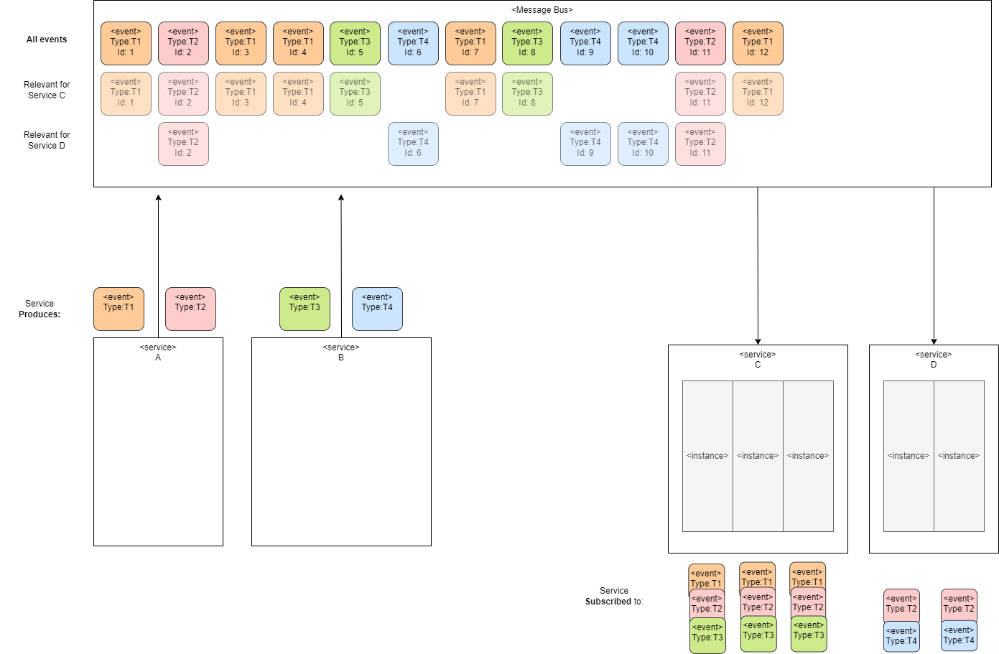
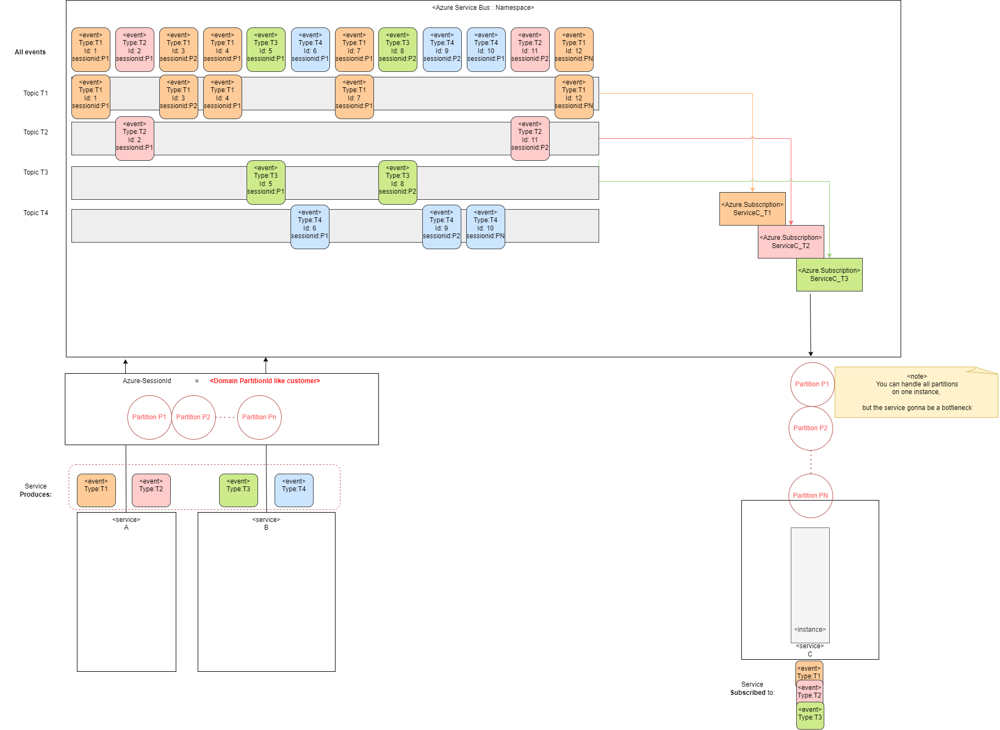
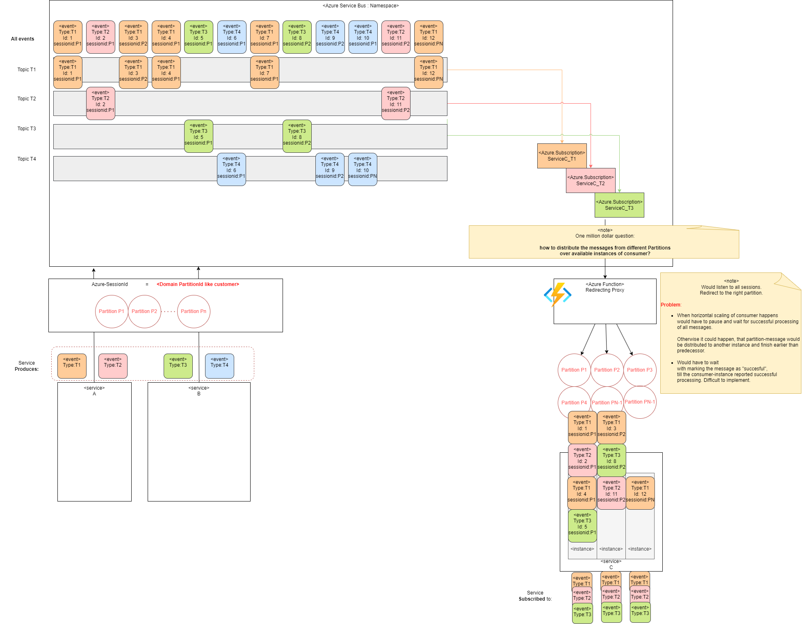
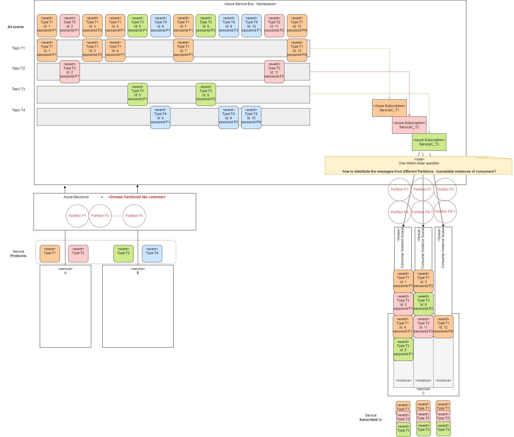

## Intro

How to implement inter-Service communication
making sure, that 
 - **"FIFO" guarantee** with  Azure Service Bus is implemented
 - **"FIFO" guarantee** with the Azure Service Bus is used

### Goal

 - There are **2 Producer** Services **A and B**
   - **Service A** produces events of type: **T1, T2**
   - **Service B** produces events of type: **T3, T4**

 - There are **2 Consumer** Services: **C and D**
   - Consumer services **scale horizontally**, so each of them has **multiple instances**
   - Each instance will consume those types of events from the message bus, in which its interested in
   - Each **instance can fail** after a while and put back the event, for reprocessing. That must NOT affect the event processing order.

### Constraints

 - The  **FIFO ORDER** MUST be enforced within a **single message-type**

        That's to simulate the situation, where each service is sending its own events and is not aware of what others are doing, which is realistic.

- **each service-instance can consume MULTIPLE event-types**.
- **consumers scale horizontally** and at **RUNTIME**. Depending on load.
- **producers** MUST be **decoupled from consumers** 
  - Means producer MUST NOT be involved into **how consumers do scale out**

### Description

The approach:

On the producer service:
- Pick a **partitioning** approach, which makes sence from the **domain-perspective**. (e.g. the customerId)
  - it must be a partition, which can be processed isolated from the others (like messages of one dedicated customer. Or country. )

On the consumer service:
- Distribute partitioned messages on **some consumer instances**
  - **messages from same partition - must be mapped always to same instance**. To avoid the situation, where message from same partition is consumed on 2 instances, finish at different time, break the processing order.
  - there **can** be much more **message-partitions**, than **consumer-instances**. Just find a way to dstribute partitions evenly on consumers.

#### Horizontal scaling consumer

So consumer  would scale horizontally.

- But who would assign partitions to consumer-instances?
- But who would distribute the messages to consumer-instances?

#### Try use a "Redirecting Proxy"

You could try implement a Redirecting Proxy Azure-function.

Which would redirect the messages from the original queues
over all available consumer instances.

But this task has a lot of challenges.

- When **horizontal scaling of consumer happens**
Redirecting Proxy would have to pause and wait for successful processing of all messages.
Otherwise it could happen, that partition-message would be distributed to another instance and finish earlier than predecessor.

- Redirecting Proxy would have to **wait
with marking the message as "succesful"**,
till the consumer-instance reported successful processing. Otherwise the message might be lost, when the consumer-instance fails.

Its difficult to implement.

Also Redirecting Proxy might become a bottleneck.

#### Try use auto-forwarding

The most stable variant is probably to use the "auto-forwarding".

- <https://techcommunity.microsoft.com/t5/apps-on-azure-blog/robust-messaging-using-azure-service-bus/ba-p/3275225>
- <https://learn.microsoft.com/en-us/azure/service-bus-messaging/enable-auto-forward>
- <https://learn.microsoft.com/en-us/azure/service-bus-messaging/service-bus-auto-forwarding>

By regrouping the messages 
- by partitions, as expected by consumer-instances

One can probably achiev the effect of stable horizontal scaling.

### Conclusion

TODO

## Links

- https://learn.microsoft.com/en-us/azure/service-bus-messaging/service-bus-queues-topics-subscriptions
- <https://learn.microsoft.com/en-us/azure/service-bus-messaging/message-sessions#session-features>
- <https://learn.microsoft.com/en-us/azure/architecture/patterns/publisher-subscriber>
- <https://learn.microsoft.com/en-us/azure/architecture/patterns/priority-queue>
- <https://learn.microsoft.com/en-us/azure/service-bus-messaging/authenticate-application#resource-scope>
- <https://learn.microsoft.com/en-us/azure/service-bus-messaging/service-bus-messaging-overview#transactions>
- <https://learn.microsoft.com/en-us/azure/service-bus-messaging/message-sessions>

