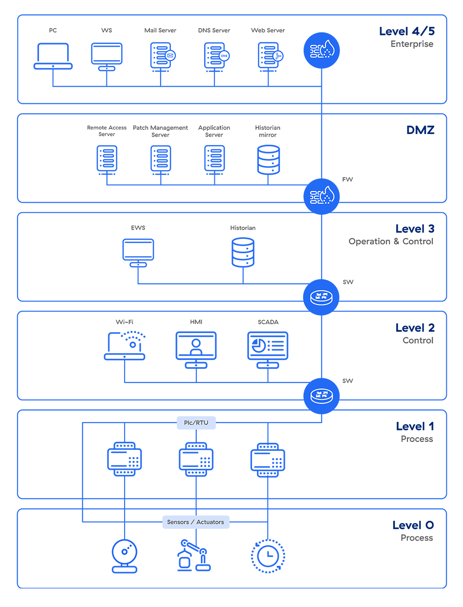

## Intro

### Purdue Model

What’s the Purpose of the Purdue Model?
The Purdue model, part of the Purdue Enterprise Reference Architecture (PERA), was designed as a reference model for data flows in computer-integrated manufacturing (CIM), where a plant’s processes are completely automated. It came to define the standard for building an ICS network architecture in a way that supports OT security, separating the layers of the network to maintain a hierarchical flow of data between them.

The model shows how the typical elements of an ICS architecture interconnect, dividing them into six zones that contain information technology (IT) and OT systems. Implemented correctly, it helps establish an “air gap” between ICS/OT and IT systems, isolating them so an organization can enforce effective access controls without hindering business.

Zones of the Purdue Model
OT systems occupy the lower levels of the model while IT systems occupy the upper levels, with a “demilitarized zone” of convergence between them.

Let’s take a look at each of the zones in the Purdue reference model, top to bottom.

## Links

- <https://www.zscaler.com/resources/security-terms-glossary/what-is-purdue-model-ics-security>
- 

