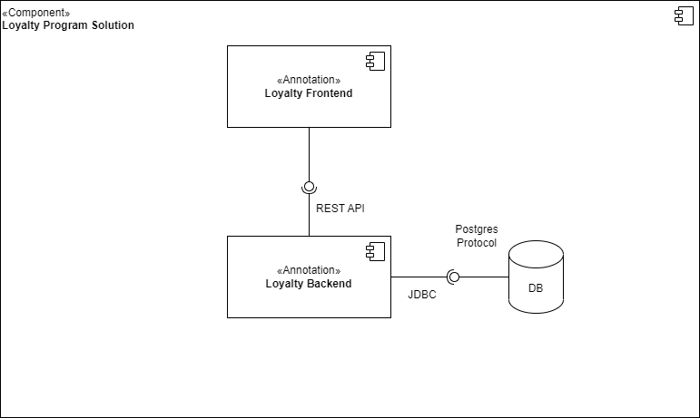
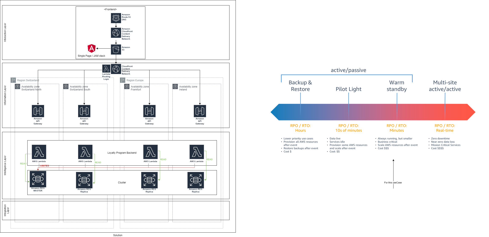

## Intro

Retailer example Case.

**Position: Solution Architect at Platform Services, Retailer**


## Scenario

**Scenario: Implementing a New Customer Loyalty Platform**

**Background:**
Retailer has decided to revamp its customer loyalty program to enhance customer engagement, retention, and data-driven decision-making. As a Solution Architect in Platform Services, you're tasked with leading the technical design and implementation of the new loyalty platform.

**Key Responsibilities:**
- Collaborate with business stakeholders, IT teams, and third-party vendors to understand requirements and technical needs for the loyalty platform.
- Design a scalable, secure, and integrated architecture that aligns with Retailer' current systems while allowing for future enhancements and adaptability.
- Ensure the proposed solution adheres to industry best practices, compliance standards, and security protocols.
- Provide guidance and support to development teams in implementing the architecture, ensuring smooth integration and functionality.

**Tasks and Challenges:**
- Conduct a comprehensive analysis of existing systems, understanding their limitations and potential integration points for the loyalty platform.
- Develop a detailed architecture plan encompassing databases, APIs, user interfaces, and backend systems, taking into account scalability, performance, and security.
- Work closely with external vendors or partners to evaluate and select suitable technologies or tools that align with Retailer' requirements.
- Collaborate with cross-functional teams to ensure alignment between the business strategy and technical implementation.

**Desired Skills and Experience:**
- Proven experience as a Solution Architect, preferably in retail or a similar industry, with a strong understanding of loyalty program systems.
- Deep technical knowledge in system architecture, databases, cloud technologies, APIs, and integration methods.
- Excellent communication skills to effectively convey complex technical concepts to non-technical stakeholders and foster collaboration among teams.
- Ability to navigate complex organizational structures and manage diverse interests to achieve project objectives.
- Strong problem-solving skills and the ability to adapt to evolving requirements and technologies.

**Expected Outcome:**
- Successful implementation of the new loyalty platform meeting business objectives and technical requirements.
- Seamless integration with existing systems, providing a robust, scalable, and secure solution.
- Documentation of the architecture and ongoing support for further enhancements and maintenance.


## Solution 4+1 View

Structure according to 4+1 view model.

See https://en.wikipedia.org/wiki/4%2B1_architectural_view_model


### 0. Scenarios / Use Case View

These use cases cover various interactions between different actors and the loyalty platform, from user actions such as registration and transactions to administrative tasks and managerial analytics. They help to outline the functional requirements and interactions necessary to implement a successful loyalty program.


#### Use Case 1: "User Registration"
- **Actor:** Customer
- **Description:** A new user registers for the loyalty program.
- **Steps:**
    1. User selects the "Register" option.
    2. User provides personal details (name, email, etc.).
    3. System validates and creates a new user account.
    4. User receives confirmation and becomes a registered member.

#### Use Case 2: "View Available Loyalty Programs"
- **Actor:** Customer
- **Description:** Registered users explore the available loyalty programs.
- **Steps:**
    1. User logs into the loyalty platform.
    2. User navigates to the "Available Programs" section.
    3. System displays a list of available loyalty programs.
    4. User selects a program to view its details.

#### Use Case 3: "Earn and Redeem Points"
- **Actor:** Customer
- **Description:** Users engage in transactions to earn and redeem loyalty points.
- **Steps:**
    1. User selects a product or service to purchase.
    2. User provides the loyalty program details during the transaction.
    3. System calculates and grants points for the purchase.
    4. User can redeem earned points for rewards or discounts.

#### Use Case 4: "Administer Loyalty Program"
- **Actor:** Program Administrator
- **Description:** Admin manages the loyalty program and user accounts.
- **Steps:**
    1. Admin logs into the loyalty program management portal.
    2. Admin views and modifies existing loyalty program details.
    3. Admin adds new offers or adjusts point structures.
    4. Admin manages user accounts, resolves issues, or offers support.

#### Use Case 5: "Analytics and Reporting"
- **Actor:** Marketing Manager
- **Description:** Manager reviews loyalty program performance and user behavior.
- **Steps:**
    1. Manager accesses the analytics dashboard.
    2. System presents data on user engagement, points earned, and redeemed.
    3. Manager generates reports for marketing campaigns and program improvements.

#### Use Case 6: "Customer Support"
- **Actor:** Support Agent
- **Description:** Support agents assist users with loyalty program-related queries.
- **Steps:**
    1. User contacts support for assistance.
    2. Agent accesses user details and transaction history.
    3. Agent resolves queries, assists with point-related issues, or provides guidance.


### 1. Logical View

Class diagram.

``` mermaid
classDiagram
    class User {
        <<Model>>
        + userId: int
        + username: string
        + email: string
        + joinDate: date
    }

    class LoyaltyProgram {
        <<Model>>
        + loyaltyProgramId: int
        + programName: string
        + startDate: date
        + endDate: date
        + isActive(): boolean
    }

    class Transaction {
        <<Model>>
        + transactionId: int
        + userId: int
        + purchaseAmount: double
        + transactionDate: date
        + earnPoints(): double
    }

    class Reward {
        <<Model>>
        + rewardId: int
        + rewardName: string
        + pointCost: int
        + description: string
    }

    User "1" -- "1..*" LoyaltyProgram
    User "1" -- "0..*" Transaction
    Transaction "1" -- "0..*" Reward

    LoyaltyProgram "1" -- "1..*" Reward

```

State Diagram

``` mermaid
stateDiagram
    [*] --> NotLoggedIn
    NotLoggedIn --> LoggedIn: Log In
    LoggedIn --> SelectProgram: View Programs
    SelectProgram --> MakeTransaction: Make Transaction
    MakeTransaction --> TransactionComplete: Complete
    TransactionComplete --> SelectProgram: Return
    TransactionComplete --> LoggedIn: Log Out
    LoggedIn --> NotLoggedIn: Log Out
```

Flow chart Diagram

``` mermaid
graph TD
    subgraph "User Interaction"
        NL[Start] -->|Log In| A(Get Program Data)
        A[Request Loyalty Programs] -->|Retrieve Data| B(Get Program Data)
        B -->|Display Programs| C
        C -->|Make Transaction| D{Transaction Success?}
        D -- Yes --> E[Transaction Complete]
        D -- No --> C
    end

```

### 2. Process View

Sequence diagram.

``` mermaid

sequenceDiagram
    participant User
    participant LoyaltyFrontend
    participant LoyaltyBackend

    User ->> LoyaltyFrontend: Request Loyalty Programs
    activate LoyaltyFrontend
    LoyaltyFrontend -->> LoyaltyBackend: Retrieve Program Data
    activate LoyaltyBackend
    LoyaltyBackend -->> LoyaltyFrontend: Send Program Data
    deactivate LoyaltyBackend
    LoyaltyFrontend -->> User: Return Program List

    User ->> LoyaltyFrontend: Make Transaction
    activate LoyaltyFrontend
    LoyaltyFrontend -->> LoyaltyBackend: Record Transaction
    activate LoyaltyBackend
    LoyaltyBackend -->> LoyaltyFrontend: Transaction Success
    deactivate LoyaltyBackend
    LoyaltyFrontend -->> User: Transaction Complete
    deactivate LoyaltyFrontend

```

### 3. Development View

Component Diagram




Package Diagram


<!-- mermaid wont render namespaces -->
<!-- ``` mermaid
classDiagram

namespace Package_UserManagement {
    class User
    class UserRegistration
    class UserAuthentication
    class UserProfileManagement
}


namespace Package_LoyaltyProgramManagement {
    class LoyaltyProgram
    class ProgramSelection
    class PointManagement
    class RewardRedemption
}

namespace Package_TransactionProcessing {
    class TransactionRecording
    class TransactionValidation
    class PurchaseProcessing
}

namespace Package_AnalyticsReporting {
    class DataAnalysis
    class ReportGeneration
    class DashboardVisualization
}

``` -->


### 4. Physical View


Deployment diagram




## Links


- 

